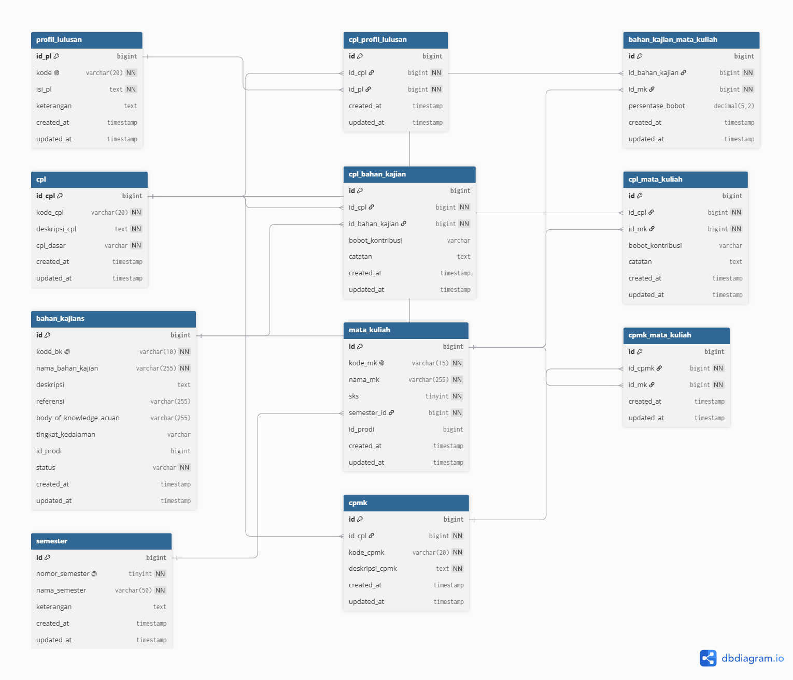

# Sistem Kurikulum OBE

Aplikasi berbasis web untuk pengelolaan kurikulum dengan pendekatan **Outcome-Based Education (OBE)**.

## Fitur

- Manajemen Profil Lulusan
- Manajemen CPL (Capaian Pembelajaran Lulusan)
- Manajemen CPMK
- Manajemen Bahan Kajian
- Manajemen Mata Kuliah
- Pemetaan CPL dengan Profil Lulusan
- Pemetaan CPL dengan Mata Kuliah
- Pemetaan CPMK dengan Mata Kuliah
- Pengelolaan Semester

## Teknologi

- Laravel 12
- PHP
- MySQL
- Tailwind CSS
- Vite

## Instalasi

Clone repository:

```bash
git clone https://github.com/pauzan1234/kurikulum-obe.git
cd kurikulum-obe
```

Install dependency PHP:

```bash
composer install
```

Install dependency JavaScript:

```bash
npm install
```

Copy file environment:

```bash
cp .env.example .env
```

Untuk Windows, bisa menggunakan:

```bash
copy .env.example .env
```

Generate application key:

```bash
php artisan key:generate
```

Kemudian atur konfigurasi database pada file `.env`.

Contoh:

```env
DB_CONNECTION=mysql
DB_HOST=127.0.0.1
DB_PORT=3306
DB_DATABASE=kurikulum
DB_USERNAME=root
DB_PASSWORD=
```

Jalankan migration:

```bash
php artisan migrate
```

Jalankan server Laravel:

```bash
php artisan serve
```

Untuk menjalankan Vite:

```bash
npm run dev
```

## Struktur Database



## Pengembangan

Project ini dikembangkan menggunakan Laravel dan dirancang untuk mendukung pengelolaan kurikulum berbasis OBE.

## License

Project ini dikembangkan untuk kebutuhan pengembangan sistem informasi kurikulum.
